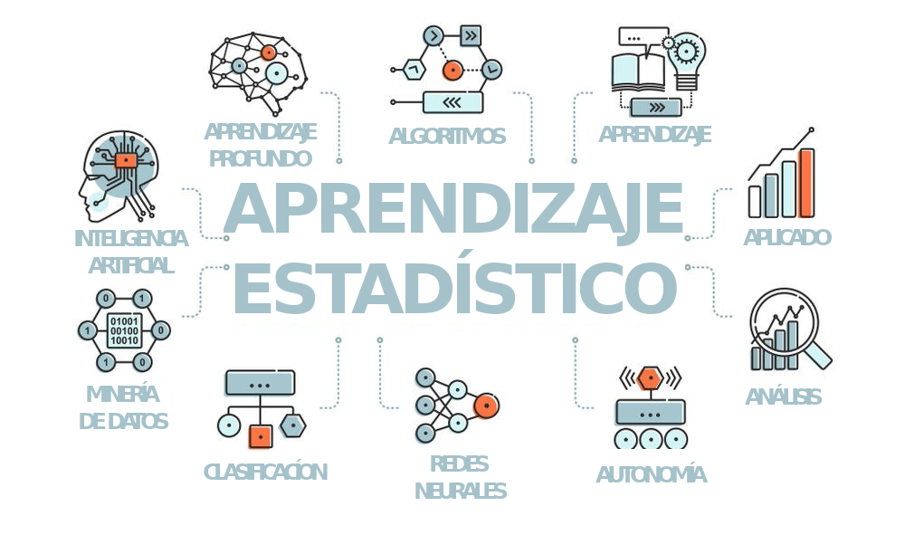
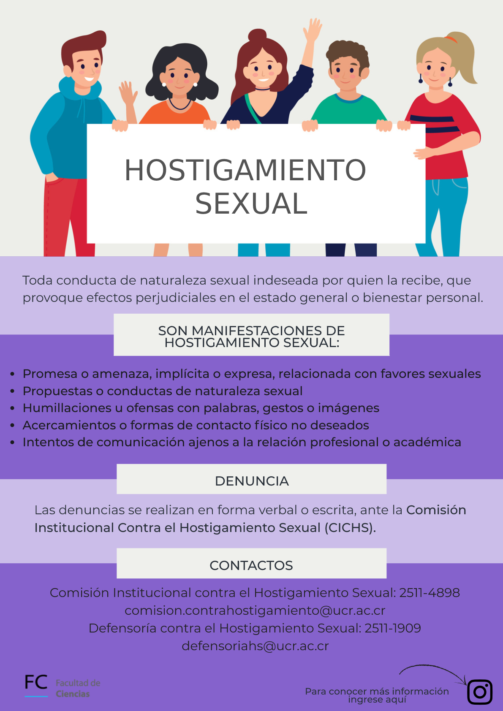
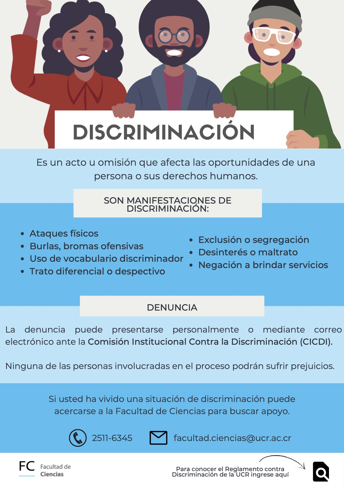

<b><a href="https://tropicalstudies.org/">Sistema de Estudios de Posgrado</a> </b>

<b><a href="https://tropicalstudies.org/">Universidad de Costa Rica</a> </b>

II semestre, 2026

<i>

<b><a href="https://marce10.github.io/">Marcelo Araya-Salas, PhD</a> </b>

</i>

El aprendizaje estadístico ("machine learning") es una subdisciplina de la inteligencia artificial que se enfoca en el desarrollo de algoritmos y modelos que permiten a las computadoras aprender patrones y hacer predicciones para tomar decisiones basadas en datos. Estos algoritmos utilizan características de los objetos de estudio para hacer predicciones sobre su estructura o comportamiento. El aprendizaje estadístico se utiliza en una amplia variedad de aplicaciones, desde el reconocimiento de voz hasta el análisis de grandes conjuntos de datos y la automatización de procesos industriales. En este curso los estudiantes podrán conocer los fundamentos y las técnicas básicas del aprendizaje estadístico para responder preguntas de investigación en Ciencias Cognoscitivas.

::: {.alert .alert-info}
### Objetivos {.unnumbered .unlisted}

- Describir y explicar los conceptos y métodos principales del aprendizaje estadístico aplicados a las Ciencias Cognoscitivas.
- Diferenciar entre los tipos de aprendizaje computacional: supervisado, no supervisado, semi-supervisado y por reforzamiento
- Comprender los fundamentos teóricos y los supuestos de técnicas como la regresión, las redes neuronales, los árboles de decisión y el análisis de conglomerados
- Implementar, en el lenguaje de programación R, las técnicas desarrolladas a lo largo del curso
- Seleccionar la técnica más adecuada en función del problema práctico o pregunta de investigación en las diversas áreas de las Ciencias Cognoscitivas.
:::

::::: columns
::: {.column width="50%"}
{width="100%"}
:::

::: {.column width="50%"}
{width="100%"}
:::
:::::
