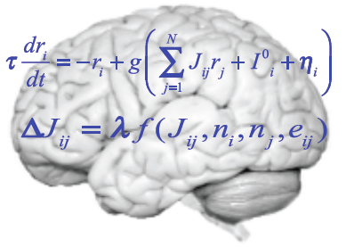
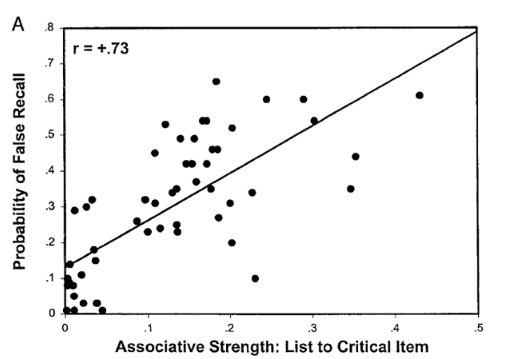
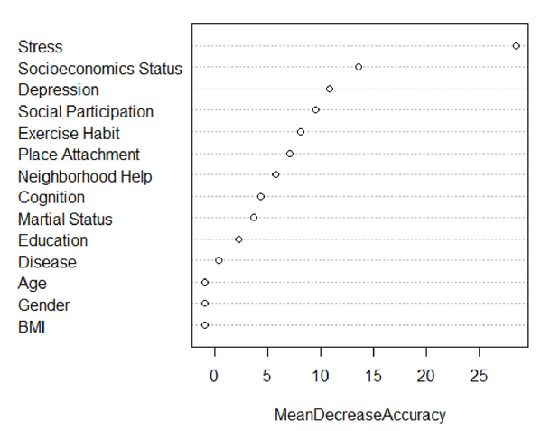
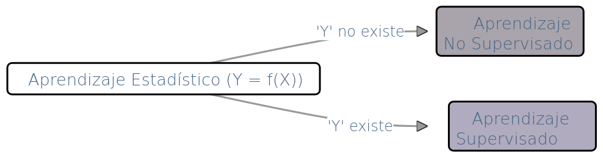
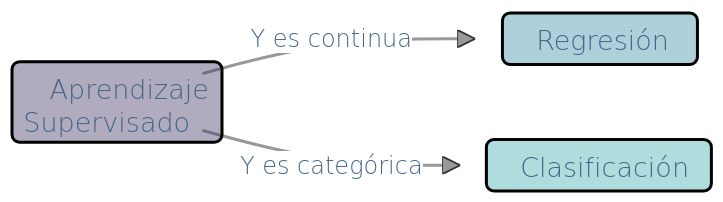
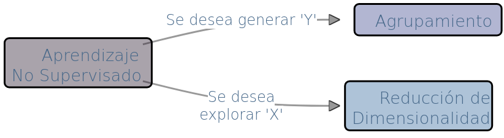
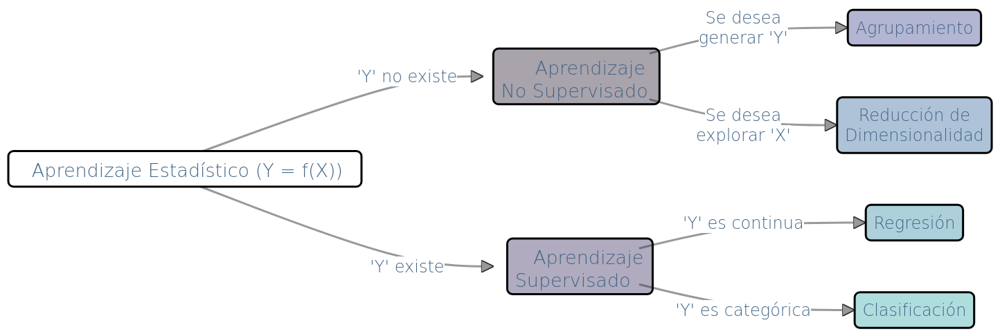
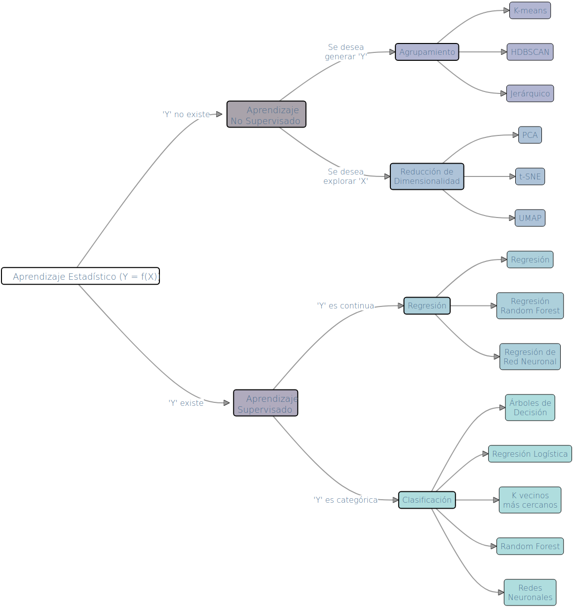
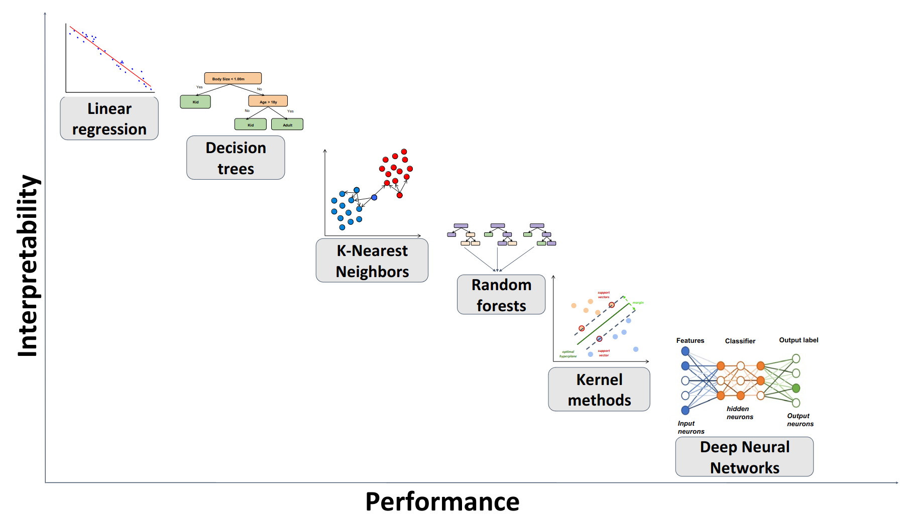

---
format:
  revealjs:
    toc: false
    number-sections: false    
    embed-resources: true
    self-contained: true
    auto-section: false 
    auto-play-media: true 
    dpi: 300
    fig-dpi: 300
    code-line-numbers: false
    code-block-border-left: true
    slide-number: true
    preview-links: auto
    css: styles_revealjs.css
editor_options: 
  chunk_output_type: console
---

```{r}
#| echo: false

library(kableExtra)
library(knitr)
library(viridis)

cols <- viridis::mako(10, alpha = 0.2)

```

# Introducción al Aprendizaje Estadístico {background-color="white" background-image="./images/neurocompu.png" background-size="60%" background-opacity="0.4"}

<center><font size=6><b><a href="https://marce10.github.io/baRulho/">Marcelo Araya-Salas</a><br></b>Universidad de Costa Rica</font><br/></center>

::: footer
<font size=3><a href="https://marce10.github.io/aprendizaje_estadistico_2026/">https://marce10.github.io/aprendizaje_estadistico_2026/</a></font>
:::

## ¿Qué es el Aprendizaje Estadístico? {background-color="white" background-image="./images/neurocompu.png" background-size="60%" background-opacity="0.1"}

<br>

-   Utilización de datos para modelar fenómenos, hacer predicciones y tomar decisiones basadas en la información extraída

-   Combina teorías estadísticas con algoritmos computacionales

## ¿Qué es el Aprendizaje Estadístico?

::: columns
::: {.column width="50%"}
{width="100%"}
:::

::: {.column width="50%"}
::: {style="font-size: x-large;"}
**Inteligencia Artificial**: hacer tareas que requieren inteligencia humana

**Aprendizaje estadístico**: uso de algoritmos para analizar datos, aprender de ellos, y hacer predicciones
:::
:::
:::

## ¿Qué es el Aprendizaje Estadístico?

::: columns
::: {.column width="50%"}
{width="100%"}
:::

::: {.column width="50%"}
::: {style="font-size: x-large;"}
**Inteligencia Artificial**: hacer tareas que requieren inteligencia humana

**Aprendizaje estadístico**: uso de algoritmos para analizar datos, aprender de ellos, y hacer predicciones

**Aprendizaje Profundo**: uso de redes neuronales profundas para analizar diversos niveles de abstracción en los datos

**Ciencia de Datos**: técnicas de análisis, procesamiento, y visualización de datos para extraer información/conocimiento de grandes volúmenes de datos
:::
:::
:::

## ¿Qué es el Aprendizaje Estadístico?

::: {style="font-size: 70px;"}
$$ Y = f(X) + E $$
:::

::: {.fragment .fade-in}
-   Y: variable dependiente (se quiere predecir o explicar)
:::

::: {.fragment .fade-in}
-   X: variable(s) independiente(s) con información relevante para predecir Y
:::

::: {.fragment .fade-in}
-   E: error no reducible
:::

## ¿Qué es el Aprendizaje Estadístico?

::: {style="font-size: 70px;"}
$$ Y = f(X) + E $$
:::

::: {.fragment .fade-in}
-   sinónimos de Y: variable dependiente, resultado (outcome), etiqueta, objetivo, etc.
:::

::: {.fragment .fade-in}
-   sinónimos de X: variable independiente, atributo (feature), dimensión, predictor, entrada (input), etc.
:::

## ¿Para que Estimar f(X)?

::: {style="font-size: 70px;"}
$$ Y = f(X) + E $$
:::

-   **Predicción**: predecir valores futuros de Y

-   **Inferencia**: establecer una relación causal (*i.e. estimar el efecto de un cambio en X sobre el cambio en Y*)

::: {.fragment .fade-in}
::: {style="font-size: 60px; color='red';"}
::: custom-color
**Aprendizaje estadístico = estimar f(X)**
:::
:::
:::

## Aplicaciones

Omnipresente en herramientas electrónicas:

-   **Detección de correo spam**: busca patrones en el contenido del mensaje, como palabras clave sospechosas y comportamientos de envío
-   **Reconocimeinto facial**: analiza las características faciales desde diferentes ángulos y aprenden a reconocer variaciones sutiles en la apariencia de un individuo
-   **Optimización de Rutas con GPS**: usa los patrones de tráfico históricos y en tiempo real para predecir y sugerir las rutas más rápidas o eficientes

## Aplicaciones en Ciencias Cognoscitivas

::: {style="font-size: 30px;"}
Crucial para entender cómo procesamos la información, tomamos decisiones y aprendemos. Algunos sub-campos que utilizan estas herramientas:

::: columns
::: {.column width="70%"}
-   **Neurociencia Cognitiva**: Identificación de patrones en la actividad cerebral relacionados con diferentes funciones cognitivas
-   **Psicología Experimental**: Modelado de comportamiento humano y predicción de respuestas psicológicas
-   **Neurociencia Computacional**: Modelado de la actividad neuronal para simular procesos cerebrales
:::

::: {.column width="30%"}
{width="100%"}
:::
:::
:::

## 

### Aplicaciones: Memoria

::: columns
::: {.column width="40%"}
::: {style="font-size: 30px;"}
-   Roediger et al 2001. [Factors that determine false recall: A multiple regression analysis](https://link.springer.com/content/pdf/10.3758/bf03196177.pdf)

-   Regresión multiple para identificar factores que influyen en el recuerdo falso

::: {.fragment .fade-in}
-   Recuerdo verídico (r = -0.43) y la fuerza de la asociación entre items (r = 0.73) influyen
:::
:::
:::

::: {.column width="60%"}
{width="100%"}
:::
:::

<br>

::: {.fragment .fade-in}
::: {style="font-size: 30px;"}
<center>$Y: recuerdo\ falso \sim X: asociacion\ entre\ items + recuerdo\ verídico + ...$</center>
:::
:::

## 

### Aplicaciones: Reconocimiento de Emociones

::: columns
::: {.column width="40%"}
::: {style="font-size: 30px;"}
-   Hema et al 2023. [*Emotional speech Recognition using CNN and Deep learning techniques*](https://www.sciencedirect.com/science/article/pii/S0003682X23002906)

-   Aprendizaje profundo en el reconocimiento y análisis del tono emocional en la voz

-   78% de precision
:::
:::

::: {.column width="60%"}
{width="100%"}
:::
:::

::: {.fragment .fade-in}
<center>$Y: emoción \sim X: estructura\ acústica$</center>
:::

## 

### Aplicaciones: Resilencia al Estrés

::: columns
::: {.column width="40%"}
::: {style="font-size: 30px;"}
-   Chen et al. 2023. [*Identifying the top determinants of psychological resilience among community older adults during COVID-19 in Taiwan: A random forest approach*](https://www.sciencedirect.com/science/article/pii/S2666827023000476)

-   Factores que determinan la resiliencia al estrés

-   80% de probabilidad de una predición correcta
:::
:::

::: {.column width="60%"}
{width="100%"}
:::
:::

::: {.fragment .fade-in}
::: {style="font-size: 30px;"}
<center>$Y:resilencia\ (binaria) \sim X: género + edad + educación + ...$</center>
:::
:::

## Tipos de Modelos

**Supervisado**: Se predice una Y conocida *a priori*

$$ Y = f(X) $$

```{r}
#| eval: true
#| echo: false

n = 5

set.seed(123)
dat <- data.frame(Y = rnorm(n = n), X1 = rnorm(n = n), X2 = rnorm(n = n), X3 = rnorm(n = n))

# knitr::kable(dat)

kbl <- kableExtra::kable(dat, align = "c", row.names = F,  format = "html", escape = F, digits = 2)

kbl <- kableExtra::kable_styling(kbl, bootstrap_options = "striped", font_size = 38) |>  kableExtra::column_spec(1, background = cols[5]) |>  kableExtra::column_spec(2:4, background = cols[8])

kbl
```

## Tipos de Modelos

**Supervisado**: Se predice una Y conocida *a priori*

$$ Y = f(X) $$

```{r}
#| eval: true
#| echo: false

n = 5

set.seed(124)
dat <- data.frame(Y = sample(LETTERS[1:3], n, replace = TRUE), X1 = rnorm(n = n), X2 = rnorm(n = n), X3 = rnorm(n = n))

# knitr::kable(dat)

kbl <- kableExtra::kable(dat, align = "c", row.names = F,  format = "html", escape = F, digits = 2)

kbl <- kableExtra::kable_styling(kbl, bootstrap_options = "striped", font_size = 38) |>  kableExtra::column_spec(1, background = cols[5]) |>  kableExtra::column_spec(2:4, background = cols[8])

kbl
```

## Tipos de Modelos

**No supervisado**: genera una Y con base en la estructura de X

$$ f(X) $$

```{r}
#| eval: true
#| echo: false

n = 5

set.seed(123)
dat <- data.frame(Y = rep("   ?   ", n), X1 = rnorm(n = n), X2 = rnorm(n = n), X3 = rnorm(n = n))

# knitr::kable(dat)

kbl <- kableExtra::kable(dat, align = "c", row.names = F,  format = "html", escape = F, digits = 2)

kbl <- kableExtra::kable_styling(kbl, bootstrap_options = "striped", font_size = 38) |>  kableExtra::column_spec(1, background = cols[6]) |>  kableExtra::column_spec(2:4, background = cols[8])

kbl

```

## Tipos de Modelos

**No supervisado**: ó explora la estructura de X

$$ f(X) $$

```{r}
#| eval: true
#| echo: false

n = 5

set.seed(123)
dat <- data.frame(X1 = rnorm(n = n), X2 = rnorm(n = n), X3 = rnorm(n = n))

# knitr::kable(dat)

kbl <- kableExtra::kable(dat, align = "c", row.names = F,  format = "html", escape = F, digits = 2)

kbl <- kableExtra::kable_styling(kbl, bootstrap_options = "striped", font_size = 38) |>   kableExtra::column_spec(1:3, background = cols[8])

kbl

```

## Escogiendo el Modelo Adecuado

<br>

<center>¿Existe Y?</center>

<br>

{width="100%"}

## Escogiendo el Modelo Adecuado

<br>

<center>Si Y existe ¿Es continua o categórica?</center>

<br> {width="100%"}

## Escogiendo el Modelo Adecuado

<br>

<center>Si Y no existe ¿Queremos generarla o solo explorar X?</center>

<br>

{width="100%"}

## Escogiendo el Modelo Adecuado

<br>

{width="100%"}

## Escogiendo el Modelo Adecuado {.scrollable .nostretch}

{width="100%"}

## Escogiendo el Modelo Adecuado

::: {style="text-align: center;"}
Interpretabilidad
:::

::: {style="font-size: 20px;"}
[*Tomado de Badillo et al 2020*](https://ascpt.onlinelibrary.wiley.com/doi/pdfdirect/10.1002/cpt.1796)
:::

{width="100%"}

# Introducción al Aprendizaje Estadístico {background-color="white" background-image="./images/neurocompu.png" background-size="60%" background-opacity="0.4"}

<center><font size=6><b><a href="https://marce10.github.io/baRulho/">Marcelo Araya-Salas</a><br></b>Universidad de Costa Rica</font><br/></center>

::: footer
<font size=3><a href="https://marce10.github.io/aprendizaje_estadistico_2026/">https://marce10.github.io/aprendizaje_estadistico_2026/</a></font>
:::
