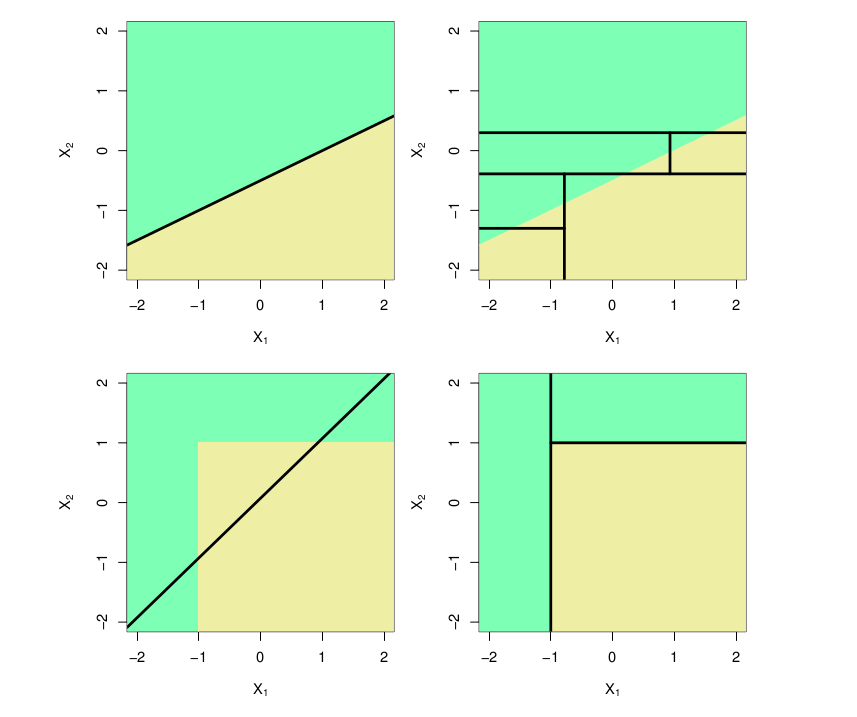

```{r}
#| warning: false
#| echo: false
 
options("digits"=5)
options("digits.secs"=3)
library(knitr)
library(ggplot2)
library(viridis)
library(ISLR)
library(rpart)
library(rpart.plot)
library(tree)
library(randomForest)
library(xgboost)

# ggplot settings
geom_histogram <- function(...) ggplot2::geom_histogram(..., fill = viridis(10, alpha = 0.5)[8], show.legend = FALSE, bins = 20, color = "black")

geom_smooth <- function(...) ggplot2::geom_smooth(..., color = viridis(10,  alpha = 0.5)[8])

geom_boxplot <- function(...) ggplot2::geom_boxplot(..., fill = viridis(10, alpha = 0.5)[7])

geom_pointrange <- function(...) ggplot2::geom_pointrange(..., show.legend = FALSE, color = viridis(10, alpha = 0.5)[7], size = 2) 

theme_set(theme_classic(base_size = 20))


fill <- list(alert = "#cff4fc", success = "#d1e7dd")

```

::: {.alert .alert-info}
# Objetivo del manual {.unnumbered .unlisted}

- Entender como se construyen los árboles de decisión

- Familiarizarse con los principales métodos de regresión y clasificación basados en ensamblado de árboles

- Aprender a aplicar estos métodos en R
:::

Paquetes a utilizar en este manual:

```{r}

# instalar/cargar paquetes
sketchy::load_packages(
  c("ggplot2", 
    "viridis", 
    "caret",
    "ISLR",
    "rpart",
    "rpart.plot",
    "tree",
    "randomForest",
    "xgboost"
   )
  )

```

Los métodos basados en árboles estratifican o subdividen el espacio predictor en en una serie de regiones simples. Dado que el conjunto de reglas de división utilizadas para segmentar el espacio predictor puede representarse en un árbol, este tipo de enfoques se conocen como métodos de árboles de decisión. Los árboles de decisión se utilizan tanto para clasificación como para regresión. Su ventaja radica en la simplicidad de interpretación y en su capacidad para capturar interacciones no lineales entre predictores.

# Regresión con árboles de decisión

Usaremos el conjunto de datos `Hitters` para predecir el salario de un jugador de béisbol basado en los años ("Years", el número de años que ha jugado en las grandes ligas) y "Hits" (el número de hits que realizó en el año anterior). Primero eliminamos las observaciones que tienen valores de salario faltantes ("Salary") y aplicamos una transformación logarítmica al salario para que su distribución tenga una forma más típica de campana.

```{r}
# cargar datos
data(Hitters)

# Eliminar observaciones con valores faltantes en Salary
Hitters <- na.omit(Hitters)

# Transformar la variable Salary al logaritmo natural
Hitters$LogSalary <- log(Hitters$Salary)

head(Hitters)
```

La siguiente figura muestra un árbol de regresión ajustado a estos datos. Consiste en una serie de reglas de división, comenzando desde la parte superior del árbol. La división superior asigna las observaciones con años \< 4.5 a la rama izquierda. El salario predicho para estos jugadores se da por el valor promedio de respuesta para los jugadores en el conjunto de datos con años \< 4.5. Para tales jugadores, el salario logarítmico medio es 5.107, por lo que hacemos una predicción de e\^5.107 miles de dólares, es decir, \$165,174, para estos jugadores. Los jugadores con Años \>= 4.5 son asignados a la rama derecha, y luego ese grupo se subdivide aún más por "Hits".

```{r}
#| echo: false

# Ajustar un árbol de regresión con un número limitado de nodos terminales
set.seed(42) # Para reproducibilidad
modelo_arbol <- tree(LogSalary ~ Years + Hits,
                   data = Hitters)

# Podar el árbol para limitarlo a 3 nodos terminales (si es necesario)
modelo_podado <- prune.tree(modelo_arbol, best = 3)

# Graficar el árbol
plot(modelo_podado)
text(modelo_podado, pretty = 0) # Agrega etiquetas legibles

```

En general, el árbol divide a los jugadores en tres regiones del espacio de predictores: jugadores que han jugado durante cuatro años o menos, jugadores que han jugado durante cinco años o más y que hicieron menos de 118 hits el año pasado, y jugadores que han jugado durante cinco años o más y que hicieron al menos 118 hits el año pasado. Estas tres regiones se pueden escribir como R1 = {X \| Años \< 4.5}, R2 = {X \| Años \>= 4.5, Hits \< 117.5}, y R3 = {X \| Años \>= 4.5, Hits \>= 117.5}. La Figura 8.2 ilustra las regiones como función de los Años y Hits. Los salarios predichos para estos tres grupos son \$1,000 × e\^5.107 = \$165,174, \$1,000 × e\^5.999 = \$402,834, y \$1,000 × e\^6.740 = \$845,346 respectivamente.

```{r}
#| echo: false

# Crear el gráfico de regiones R1, R2 y R3
# Configurar los límites de los ejes y plotear los datos
plot(
  Hitters$Years,
  Hitters$Hits,
  col = "#38AAAC80",
  pch = 19,
  xlab = "Años",
  ylab = "Hits",
  xlim = c(1, 24),
  ylim = c(1, 238)
)

#Línea vertical
abline(v = 4.5, col = "#3B2F5E80", lwd = 2)

# linea horizontal
lines(c(4.5, 30),
      c(117.5, 117.5),
      col = "#3B2F5E80",
      lwd = 2)

# Agregar etiquetas para las regiones
text(2, 200, "R1", cex = 1.2)
text(10, 50, "R2", cex = 1.2)
text(10, 200, "R3", cex = 1.2)

```

Siguiendo con la analogía del árbol, las regiones R1, R2 y R3 se conocen como nodos terminales o hojas del árbol. Los puntos a lo largo del árbol donde se divide el espacio del predictor se denominan nodos internos. En el árbol graficado mas arriba los dos nodos internos están indicados por el texto "Years \< 4.5" y "Hits \< 117.5". Nos referimos a los segmentos del árbol que conectan los nodos como ramas.

Podríamos interpretar el árbol de regresión mostrado mas arriba de la siguiente manera: *Los años son el factor más importante para determinar el salario, y los jugadores con menos experiencia ganan salarios más bajos que los jugadores más experimentados. Dado que un jugador tiene menos experiencia, parece que el número de hits que realizó en el año anterior juega un papel poco relevante en su salario. Pero entre los jugadores que han estado en las grandes ligas durante cinco años o más, el número de hits realizados en el año anterior sí afecta al salario, y los jugadores que hicieron más hits el año pasado tienden a tener salarios más altos.*

Los valores predichos por el modelo dependen del estrato en el que caen los datos. Por ejemplo, si un jugador ha jugado durante 5 años y ha realizado 100 hits, entonces caerá en el estrato R2 y su salario predicho será el promedio de los salarios de los jugadores en R2.

## Ajuste del modelo

El árbol que se genera para estos datos en realidad es mucho mas complejo y contiene mas divisiones de los datos en mas estratos. Los paquetes `rpart` y `rpart.plot` nos permite ajustar y visualizar estos modelos de una forma muy amigable:

```{r}

# Ajustar un árbol de regresión
arbol_regresion <- rpart::rpart(LogSalary ~ Years + Hits, data = Hitters)

# Visualizar el árbol
rpart.plot::rpart.plot(arbol_regresion, extra = 101)

```

La complejidad del árbol la podemos controlar mediante el parámetro `cp` ("complexity parameter"). Un valor más alto de `cp` resulta en un árbol más simple (con menos divisiones o reglas), mientras que un valor más bajo permite árboles más grandes y complejos. El objetivo es encontrar un equilibrio entre un árbol que sea suficientemente complejo para capturar patrones importantes en los datos, pero no tan complejo que incurra en sobreajuste. Por ejemplo, este es un árbol con un valor de `cp` de 0.05:

```{r}

arbol_cp.05 <- rpart(LogSalary ~ Years + Hits,
                     data = Hitters,
                     control = rpart.control(cp = 0.05))

rpart.plot(arbol_cp.05, extra = 101)

```

Este en cambio tiene un valor de `cp` de 0.001:

```{r}

arbol_cp.001 <- rpart(LogSalary ~ Years + Hits, data = Hitters, control = rpart.control(cp = 0.001))

rpart.plot(arbol_cp.001, extra = 101)

```

## Validación cruzada

Afortunadamente la librería `caret` nos permite realizar validación cruzada para encontrar el mejor valor de `cp` para nuestro modelo. Podemos utilzar cualquiera de los métodos vistos en el manual de "sobreajuste y entrenamiento de modelos". En este caso usamos el método de "dejar uno afuera" (LOOCV) para optimizar el valor de `cp`:

```{r}

# Configuración de validación cruzada
set.seed(42) # Para reproducibilidad
# Validación cruzada
train_control <- trainControl(method = "LOOCV")

# Entrenar el modelo de árbol usando caret
modelo_arbol <- train(
  LogSalary ~ Years + Hits,
  data = Hitters,
  method = "rpart", # Árbol de decisión
  trControl = train_control,
  tuneLength = 10 # Número de combinaciones de parámetros a probar
)         

# Resumen del modelo ajustado
print(modelo_arbol)
```

El mejor valor de `cp` encontrado por la validación cruzada es `r modelo_arbol$results$cp[1]` y un valor de RMSE de `r modelo_arbol$results$RMSE[1]`. Podemos extraer y visualizar el árbol final así:

```{r}

# extraer mejor modelo
mejor_modelo <- modelo_arbol$finalModel

# Visualizar el árbol final
rpart.plot(mejor_modelo, extra = 101)

```

## Comparación con modelos lineales

Con el siguiente gráfico podemos comparar el comportamiento de un modelo lineal con el de un árbol de regresión, usando un ejemplo de clasificación en dos dimensiones. En este ejemplo en el que la verdadera frontera de decisión es lineal, y está indicada por las regiones sombreadas. En la fila superior se ilustra como un enfoque clásico que asume una frontera lineal (izquierda) superará a un árbol de decisión que realiza divisiones paralelas a los ejes (derecha). En la fila inferior la verdadera frontera de decisión es no lineal. En este caso, un modelo lineal no puede capturar la verdadera frontera de decisión (izquierda), mientras que un árbol de decisión tiene éxito (derecha).



*Tomado de Gareth et al 2013*

::: {.alert .alert-info}
## Ejercicio 1

1.  Utilice un árbol de decisión de regresión para resolver el ejercicio 1 de la [tarea 3](http://localhost:5307/programa.html#tarea-3).

2.  Realice la validación cruzada con el método de remuestreo de "boostrap" para entrenar el modelo.
:::

# Clasificación con árboles de decisión

Al igual que los modelos de regresión con árboles de decisión, los árboles de clasificación dividen el espacio predictor en una serie de regiones simples utilizando reglas de decisión, con el objetivo de predecir una clase o categoría como resultado. Este enfoque es similar al de los árboles de regresión, pero el criterio de división optimiza una métrica asociada con la clasificación, como la **entropía** o el **índice de Gini**.

Usaremos el conjunto de datos `Carseats` para predecir si las ventas son altas (High = "Yes") o bajas (High = "No") en función de varias características del conjunto de datos, como precio (`Price`) o publicidad (`Advertising`).

```{r}
# explorar
head(Carseats)

```

Primero preprocesamos los datos para crear la variable objetivo binaria:

```{r}
# Cargar datos
data(Carseats)

# Crear variable de respuesta binaria
Carseats$High <- ifelse(Carseats$Sales > 8, "Yes", "No")
Carseats$High <- factor(Carseats$High)  # Convertir a factor

# Eliminar la variable 'Sales' para evitar colinealidad
Carseats$Sales <- NULL
```

## Ajuste del modelo

Ajustaremos un árbol de clasificación simple utilizando la librería `rpart` y visualizaremos el árbol generado.

```{r}
# Ajustar un árbol de clasificación
arbol_clasificacion <- rpart(High ~ Price + Advertising + ShelveLoc + Age, 
                             data = Carseats, 
                             method = "class")

# Visualizar el árbol
rpart.plot(arbol_clasificacion, extra = 104, fallen.leaves = TRUE, shadow.col = "gray")
```

El árbol resultante muestra cómo los datos se dividen en regiones basadas en los predictores. Por ejemplo, el predictor más importante puede ser `Price`, donde precios más bajos están asociados con mayores ventas.

En el gráfico los **nodos terminales** indican la clase predicha (`Yes` o `No`) y el porcentaje de datos que pertenecen a esa clase. Las divisiones están basadas en reglas como `Price >= 93`.

## Evaluación

Para evaluar el desempeño del modelo, dividiremos los datos en conjuntos de entrenamiento y prueba y generaremos una matriz de confusión:

```{r}
# Dividir en conjunto de entrenamiento y prueba
set.seed(42)
train_index <- sample(seq_len(nrow(Carseats)), size = 0.7 * nrow(Carseats))
train_data <- Carseats[train_index, ]
test_data <- Carseats[-train_index, ]

# Ajustar árbol con datos de entrenamiento
arbol_train <- rpart(High ~ Price + Advertising + ShelveLoc + Age, 
                     data = train_data, 
                     method = "class")

# Predicciones en el conjunto de prueba
predicciones <- predict(arbol_train, test_data, type = "class")

# Matriz de confusión
caret::confusionMatrix(test_data$High, predicciones)
```

## Validación Cruzada

Para seleccionar el mejor valor de `cp`, usamos validación cruzada con la librería `caret`:

```{r}
# Configuración de validación cruzada
set.seed(42)
control <- trainControl(method = "cv", number = 10)

# Ajustar modelo con validación cruzada
modelo_cv <- train(
  High ~ Price + Advertising + ShelveLoc + Age, 
  data = train_data,
  method = "rpart",
  trControl = control
)

# Mostrar los resultados
print(modelo_cv)

# Visualizar el árbol final
rpart.plot(modelo_cv$finalModel, extra = 104)
```

El valor óptimo de `cp` es `r modelo_cv$bestTune$cp`. El árbol final representa la mejor combinación de simplicidad y precisión según la validación cruzada.

Ahora podemos evaluar el desempeño del mejor modelo:

```{r}
arbol_train_cv <-
  rpart(
    High ~ Price + Advertising + ShelveLoc + Age,
    data = Carseats,
    control = rpart.control(cp = modelo_cv$bestTune$cp),
    method = "class"
  )

# Predicciones en el conjunto de prueba
predicciones <- predict(arbol_train_cv, Carseats, type = "class")

# Matriz de confusión
caret::confusionMatrix(Carseats$High, predicciones)
```

------------------------------------------------------------------------

::: {.alert .alert-info}
## Ejercicio 2

1.  Ajusta un árbol de clasificación utilizando otras variables predictoras (por ejemplo, `Income` o `Population`).

2.  Realiza validación cruzada con un enfoque distinto (por ejemplo, validación LOOCV).
:::

# Métodos de ensamblado de árboles

Estos modelos son una extensión de árboles de decisión, los cuales representan una familia diversa y poderosa de técnicas en el aprendizaje estadístico y computacional. Al igual que los árboles de decisión, las extensiones de estos se basan en dividir los datos en subconjuntos más pequeños mediante reglas de decisión, lo que facilita la interpretación y el manejo de relaciones complejas entre variables. Sin embargo, los árboles simples a menudo carecen de precisión en comparación con métodos más sofisticados. Por ello, se han desarrollado diversas extensiones y variantes que optimizan su desempeño y amplían su aplicabilidad. Estas extensiones utilizan múltiples árboles de decisión para mejorar la precisión y robustez del modelo, y se conocen como métodos basados en el emsamblado de múltiples árboles.

Los métodos de emsamblado de árboles de decisión (como *Bagging*, *Random Forest*, *GBM*, *XGBoost* y *Extra Trees*) comparten varias características en su construcción y diseño del modelo. Estas características clave incluyen:

1.  **Uso de múltiples árboles de decisión**: Todos estos métodos generan una población de árboles de decisión, que se combinan (i.e. ensamblan) para mejorar el rendimiento predictivo en comparación con un único árbol de decisión.

2.  **Aleatoriedad en la construcción de los árboles**: Seleccionan subconjuntos aleatorios de datos para construir cada árbol (bootstrap sampling) e introducen aleatoriedad adicional en la selección de las variables que se evalúan en cada división.

3.  **Uso de hiperparámetros**: Los hiperparámetros en los modelos de aprendizaje estadístico son configuraciones o valores que controlan el comportamiento del modelo. Todos estos métodos requieren la configuración de hiperparámetros para controlar aspectos como:

    - Número de árboles.
    - Profundidad máxima de los árboles.
    - Fracción de muestras o variables utilizadas por árbol.

Ventajas de los métodos de ensamblado de árboles:

1.  **Reducción de la varianza**: combinan las predicciones de múltiples árboles para promediar (regresión) o votar (clasificación), reduciendo la varianza del modelo.

2.  **Manejo de alta dimensionalidad**: Son efectivos en conjuntos de datos con un gran número de variables predictoras, aprovechando su capacidad para identificar las más relevantes.

3.  **Robustez frente al sobreajuste**: La combinación de múltiples árboles hace que estos métodos sean menos propensos al sobreajuste en comparación con un solo árbol. Sin embargo, boosting puede sobreajustar si no se ajustan correctamente los hiperparámetros.

Estas características hacen que los métodos basados en poblaciones de árboles sean potentes y flexibles, siendo adecuados para problemas complejos en los que un modelo de árbol único podría fallar.

En este tutorial trabajaremos con 2 de estos métodos: *Random Forest* y *XGBoost*

## Random Forest

El método de *Random Forest* es una extensión de los árboles de decisión que utiliza una combinación de múltiples árboles para mejorar la precisión y la robustez del modelo. Cada árbol se ajusta utilizando una muestra aleatoria con reemplazo (*bootstrap*) de los datos de entrenamiento, y en cada división del árbol se selecciona un subconjunto aleatorio de predictores. Esta estrategia reduce la correlación entre los árboles, mejorando el rendimiento general. A diferencia de un único árbol de decisión, los *Random Forest* son menos propensos a sobreajustar los datos.

Los principales hiperparámetros del **Random Forest** son los siguientes:

1.  **Número de árboles (ntree)**:Determina cuántos árboles se generarán en el bosque. Más árboles generalmente mejoran la estabilidad y la capacidad de generalización, pero aumentan el tiempo de cálculo. Valor típico: 500 o 100.

2.  **Número de predictores seleccionados por división (mtry)**: Define cuántas variables se seleccionan aleatoriamente de todas las disponibles para considerar en cada división de nodo. Valores más bajos aumentan la diversidad entre los árboles. Valores más altos hacen que los árboles sean más similares. Valor típico en clasificación: raíz cuadrada del número total de predictores. Valor típico en regresión: Total de predictores / 3.

3.  **Tamaño mínimo de los nodos terminales (nodesize)**: Controla el número mínimo de observaciones en los nodos terminales. Valores pequeños permiten modelos más complejos. Valores grandes simplifican los árboles y previenen el sobreajuste. Valor típico: Clasificación: 1. Regresión: 5.

Estos hiperparámetros se pueden ajustar utilizando técnicas como búsqueda en cuadrícula (grid search) o búsqueda aleatoria (random search) en el paquete `caret`.

## Ajuste de un modelo Random Forest

En esta sección, utilizaremos el conjunto de datos `heart` para clasificar si un paciente tiene enfermedad cardíaca (`sick`) basada en variables clínicas como el colesterol, la frecuencia cardíaca máxima, entre otras. El conjunto de datos incluye observaciones categóricas y numéricas, lo que lo hace ideal para ilustrar la flexibilidad de *Random Forest*.

Primero debemos leer los datos y darles el formato adecuado:

```{r}
#| eval: false
#| echo: false
#| 
# leer
heart <- read.csv(
  "https://archive.ics.uci.edu/ml/machine-learning-databases/heart-disease/processed.cleveland.data",
  header = FALSE,
  sep = ",",
  na.strings = '?'
)

# renombrar columnas
names(heart) <- c(
  "age",
  "sex",
  "cp",
  "trestbps",
  "chol",
  "fbs",
  "restecg",
  "thalach",
  "exang",
  "oldpeak",
  "slope",
  "ca",
  "thal",
  "sick"
)

write.csv(heart, "./data/heart_data.csv", row.names = FALSE)

```

```{r}

heart <- read.csv("https://raw.githubusercontent.com/maRce10/aprendizaje_estadistico_2026/refs/heads/master/data/heart_data.csv")

# Nueva Columna
heart$sick <- ifelse(heart$sick == 0, "No", "Yes")

# hacerlo factor para q sea interpretado como categorico
heart$sick <- factor(heart$sick)

# Eliminar datos faltantes
heart <- na.omit(heart)

# revisar
head(heart)
```

En [este enlace](https://rpubs.com/albvsant/proyecto_1Parcial_par6) podemos ver una descripción de los datos.

Ahora podemos ajustar un modelo *Random Forest* a los datos:

```{r}

# Ajustar modelo Random Forest
set.seed(42) # Para reproducibilidad
modelo_rf <- randomForest::randomForest(
  sick ~ ., 
  data = heart, 
  importance = TRUE,  # Para calcular la importancia de las variables
  ntree = 50000         # Número de árboles
)

# Resumen del modelo
print(modelo_rf)
```

El resultado muestra la tasa de error para cada clase, así como el error general (*Out-of-Bag error*, OOB). Este error se calcula al predecir observaciones no incluidas en la muestra *bootstrap* utilizada para construir cada árbol, lo que proporciona una estimación interna de la precisión del modelo.

## Importancia de las variables

Una ventaja de los *Random Forest* es que pueden calcular automáticamente la importancia de cada predictor en la clasificación o predicción. Esto se mide mediante la reducción en la pureza del nodo (*Gini index*) o la precisión del modelo al permutar aleatoriamente los valores de cada predictor.

```{r}
# Importancia de las variables
importancia <- randomForest::importance(modelo_rf)
print(importancia)


# print ggplot gini importance
ggplot(importancia, aes(x = reorder(rownames(importancia), MeanDecreaseGini), y = MeanDecreaseGini)) +
  geom_bar(stat = "identity", fill = viridis(10)[3]) +
  coord_flip() +
  labs(x = "Variables", y = "Importancia (Mean Decrease Gini)")

```

La gráfica de importancia muestra las variables que contribuyen más al modelo. En este ejemplo, podemos observar que `r rownames(importancia)[order(importancia[,"MeanDecreaseAccuracy"], decreasing = T)][1]`, `r rownames(importancia)[order(importancia[,"MeanDecreaseAccuracy"], decreasing = T)][2]` y `r rownames(importancia)[order(importancia[,"MeanDecreaseAccuracy"], decreasing = T)][3]` son especialmente importantes para predecir si un paciente tiene enfermedad cardíaca.

## Validación cruzada

Podemos usar el paquete `caret` para realizar una búsqueda de hiperparámetros en *Random Forest*, optimizando el número de predictores considerados en cada división del árbol (`mtry`) mediante validación cruzada.

```{r}
library(caret)

# Configuración de validación cruzada
set.seed(42)
train_control <- trainControl(method = "cv", number = 10) # Validación cruzada 10-fold

# Entrenar modelo usando caret
modelo_rf_caret <- train(
  sick ~ ., 
  data = heart, 
  method = "rf", 
  trControl = train_control, 
  tuneLength = 10 # Número de combinaciones de parámetros a probar
)

# Resultados
print(modelo_rf_caret)

# Hiperarametros del mejor modelo
modelo_rf_caret$bestTune
```

El resultado muestra el mejor valor de `mtry` encontrado por validación cruzada y la precisión asociada. Este valor puede ser utilizado para ajustar un modelo final.

Podemos evaluar el desempeño del modelo con los hiperparametros optimizados:

```{r}
# predecir el modelo en todos los datos
predicciones <- predict(modelo_rf_caret, heart)

# matriz de confusion
confusionMatrix(predicciones, heart$sick)

```

## Visualización del error Out-of-Bag (OOB)

El *Random Forest* proporciona una estimación del error OOB durante el ajuste, lo que permite analizar cómo se comporta el modelo conforme aumentan los árboles.

```{r}
# Error OOB
a <- plot(
  modelo_rf, 
  main = "Error OOB en Random Forest",
  col = viridis(10)[3]
)

```

Este gráfico muestra cómo se estabiliza el error conforme se incrementa el número de árboles, lo que ayuda a determinar si se ha utilizado un número suficiente. El gráfico muestra 3 líneas: una para el error global y una para cada una de las categorías de la variable respuesta.

::: {.alert .alert-info}
## Ejercicio 3

1.  Utilice *Random Forest* para resolver el ejercicio 4 de la [tarea 3](http://localhost:5307/programa.html#tarea-3).

2.  Realice la validación cruzada con el método de remuestreo repetido ("repeated CV") para entrenar el modelo.

3.  Calcule la matriz de confusión, la exactitud y el área bajo la curva para el modelo del punto anterior.
:::

## Boosting

El método *XGBoost* (Extreme Gradient Boosting) es una implementación eficiente y optimizada de *Boosting*. A diferencia de los métodos de *Random Forest*, donde se genera un conjunto de árboles entrenados de manera independiente, *XGBoost* construye los árboles secuencialmente, corrigiendo los errores del modelo anterior en cada iteración. Cada árbol adicional se ajusta a los residuos (errores) del modelo anterior. Esta técnica tiende a ser más poderosa y flexible para resolver problemas de clasificación y regresión.

### Hiperparámetros

Los principales hiperparámetros del *XGBoost* son los siguientes:

1.  **Número de árboles (nrounds)**: Número total de árboles a generar. Más árboles pueden mejorar la precisión, pero también pueden aumentar el sobreajuste si no se regularizan adecuadamente. Valor típico: 100-1000 dependiendo del tamaño de los datos.

2.  **Tasa de aprendizaje (eta)**: Controla cuánto contribuye cada árbol nuevo en el modelo. Un valor más bajo puede mejorar la generalización, pero requiere más árboles. Valores más altos pueden acelerar el entrenamiento pero aumentar el riesgo de sobreajuste. Valor típico: 0.01-0.3.

3.  **Profundidad máxima de los árboles (max_depth)**: Limita la profundidad máxima de los árboles. Valores más altos permiten que el árbol aprenda más patrones complejos, pero también pueden causar sobreajuste. Valor típico: 3-10.

4.  **Tamaño mínimo de los nodos (min_child_weight)**: Determina el número mínimo de muestras en un nodo para crear una nueva división. Valores más bajos permiten más divisiones, lo que puede llevar al sobreajuste. Valor típico: 1-10.

5.  **Submuestreo (subsample)**: Define la proporción de muestras que se usarán para entrenar cada árbol. La submuestreo ayuda a reducir el sobreajuste, especialmente cuando se tienen muchos datos. Valor típico: 0.5-1.0.

6.  **Submuestreo de características (colsample_bytree)**: Controla la fracción de características que se utilizan en cada árbol. Ayuda a reducir el sobreajuste al crear árboles más diversos. Valor típico: 0.5-1.0.

Estos hiperparámetros se pueden ajustar utilizando técnicas como búsqueda en cuadrícula o búsqueda aleatoria (como en `caret`).

## Ajuste de un modelo XGBoost

En esta sección, utilizaremos nuevamente el conjunto de datos `heart` para clasificar si un paciente tiene enfermedad cardíaca (`sick`) basándonos en las mismas variables que usamos con *Random Forest*.

Podemos ajustar el modelo XGBoost así:

```{r}

# Crear el conjunto de datos de entrenamiento
X <- as.matrix(heart[, -ncol(heart)])  # Variables predictoras
y <- as.numeric(heart$sick) - 1  # Convertir a valores 0 y 1

# Configuración de los hiperparámetros
param <- list(
  objective = "binary:logistic", 
  eval_metric = "logloss", 
  max_depth = 6, 
  eta = 0.1, 
  subsample = 0.8, 
  colsample_bytree = 0.8
)

# Entrenamiento del modelo XGBoost
modelo_xgb <- xgboost(
  data = X, 
  label = y, 
  nrounds = 30, 
  params = param, 
  verbose = 0
)

# Ver el resultado del modelo
print(modelo_xgb)
```

## Importancia de las variables

Al igual que con *Random Forest*, podemos ver la importancia de las variables utilizando el método `xgb.importance()`:

```{r}
# Importancia de las variables
importancia_xgb <- xgb.importance(colnames(X), model = modelo_xgb)
print(importancia_xgb)

# Visualizar la importancia
xgb.plot.importance(importance_matrix = importancia_xgb)
```

## Validación cruzada

Podemos realizar una búsqueda de hiperparámetros usando validación cruzada con el paquete `caret`, al igual que con *Random Forest*. Sin embargo, en este caso, utilizaremos el método `xgbTree` para ajustar el modelo XGBoost. **Ajustar este modelo es computacional intensivo y puede durar varios minutos en correr**. Por lo tanto luego de correrlo lo guardamos como un archivo "RDS". Estos archivos permiten guardar objetos de **R** de forma que se puedan leer nuevamente con facilidad manteniendo todos sus atributos:

```{r}
#| eval: false

# Configuración de validación cruzada
train_control <- trainControl(method = "cv", number = 10)  # Validación cruzada 10-fold

# Entrenar el modelo con caret
# modelo_xgb_caret <- train(
#   sick ~ ., 
#   data = heart, 
#   method = "xgbTree", 
#   trControl = train_control
# )

# Create predictor matrix and response
X <- model.matrix(sick ~ ., heart)[, -1]
y <- as.numeric(heart$sick) - 1   # assumes levels are No, Yes

dtrain <- xgb.DMatrix(
  data = X,
  label = y
)

# 10-fold cross-validation
cv <- xgb.cv(
  params = list(
    objective = "binary:logistic",
    eval_metric = "error"
  ),
  data = dtrain,
  nrounds = 100,
  nfold = 10,
  verbose = 0
)

# Train final model
modelo_xgb <- xgb.train(
  params = list(
    objective = "binary:logistic",
    eval_metric = "error"
  ),
  data = dtrain,
  nrounds = 100
)

saveRDS(modelo_xgb_caret, "modelo_xgb_caret.RDS")
```

Ahora podemos leer el modelo y ver los resultados:

```{r}
modelo_xgb_caret <- readRDS("modelo_xgb_caret.RDS")

# Resultados
print(modelo_xgb_caret)
```

Estos son los valores optimizados de los hiperparámetros del modelo XGBoost. Podemos usar estos valores para ajustar un modelo final con los mejores hiperparámetros.

```{r}
# Mejor valor de max_depth y eta
modelo_xgb_caret$bestTune
```

Podemos evaluar el desempeño del modelo con los hiperparametros optimizados:

```{r}
# predecir el modelo en todos los datos
predicciones <- predict(modelo_xgb_caret, newdata = heart)

# matriz de confusion
confusionMatrix(predicciones, heart$sick)

```

## Comparación de Random Forest y XGBoost

```{r}
#| echo: false

# Crear el data frame con la comparación
comparacion_rf_xgb <- data.frame(
  Característica = c(
    "Algoritmo base", 
    "Velocidad de entrenamiento", 
    "Desempeño en datos complejos", 
    "Robustez frente al ruido", 
    "Regularización", 
    "Interpretabilidad", 
    "Optimización de hiperparámetros", 
    "Escenarios recomendados", 
    "Uso común", 
    "Bibliotecas"
  ),
  XGBoost = c(
    "Gradient Boosting (modelos secuenciales)", 
    "Más lento debido a su naturaleza secuencial", 
    "Excelente para relaciones no lineales complejas", 
    "Puede ser sensible al ruido si no se regulariza adecuadamente", 
    "Incluye regularización L1 y L2 para evitar sobreajuste", 
    "Difícil de interpretar", 
    "Requiere un ajuste cuidadoso para obtener buen desempeño", 
    "Problemas grandes y complejos con alta dimensionalidad", 
    "Competencias de machine learning, predicción precisa", 
    "`xgboost`, `lightgbm`"
  ),
  Random_Forest = c(
    "Bagging (modelos independientes)", 
    "Más rápido gracias al entrenamiento paralelo", 
    "Bueno, pero menos preciso en relaciones complejas", 
    "Muy robusto frente al ruido", 
    "No incluye regularización explícita", 
    "Más sencillo, especialmente con medidas de importancia", 
    "Menos dependiente del ajuste de hiperparámetros", 
    "Exploración inicial de datos o problemas más simples", 
    "Modelos base y análisis preliminares", 
    "`randomForest`, `ranger`"
  )
)

# Imprimir el data frame
comparacion_rf_xgb

```

```{r}
#| eval: false
#| echo: false

| **Método**        | **Pros**                                                              | **Contras**                                                                | **Código con `caret`**  | **Nivel de robustez** |
|---------------|---------------|---------------|---------------|---------------|
| **Bagging**       | \- Reduce la varianza.                                                | \- Puede sobreajustar si los árboles individuales son complejos.           | `method = "treebag"`    | Alta                  |
|                   | \- Fácil de implementar y entender.                                   | \- Computacionalmente intensivo para conjuntos de datos grandes.           |                         |                       |
| **Random Forest** | \- Reduce la varianza y el sobreajuste comparado con el bagging.      | \- Más complejo y difícil de interpretar.                                  | `method = "rf"`         | Muy alta              |
|                   | \- Maneja datos con muchas variables predictoras.                     | \- Puede ser computacionalmente intensivo.                                 |                         |                       |
| **GBM**           | \- Alta precisión para conjuntos de datos grandes y complejos.        | \- Susceptible a sobreajuste si no se sintonizan bien los hiperparámetros. | `method = "gbm"`        | Muy alta              |
|                   | \- Admite muchas funciones de pérdida y ajuste.                       | \- Requiere más configuración y tiempo de entrenamiento que Random Forest. |                         |                       |
| **XGBoost**       | \- Extremadamente eficiente y rápido en comparación con GBM estándar. | \- Requiere más esfuerzo para tunear hiperparámetros.                      | `method = "xgbTree"`    | Muy alta              |
|                   | \- Muy utilizado en competencias de ciencia de datos.                 | \- Más complejo de interpretar debido a su optimización agresiva.          |                         |                       |
| **Extra Trees**   | \- Menos susceptible al sobreajuste que Random Forest.                | \- A veces menos preciso que otros métodos avanzados como XGBoost.         | `method = "extraTrees"` | Alta                  |
|                   | \- Muy rápido para conjuntos de datos grandes.                        | \- No tan popular, por lo que puede haber menos documentación.             |                         |                       |


```

------------------------------------------------------------------------

# Referencias {.unnumbered .unlisted}

Gareth, J., Daniela, W., Trevor, H., & Robert, T. (2013). *An introduction to statistical learning: with applications in R*. Spinger.

# Información de la sesión {.unnumbered .unlisted}

```{r session info, echo=F}

sessionInfo()

```
